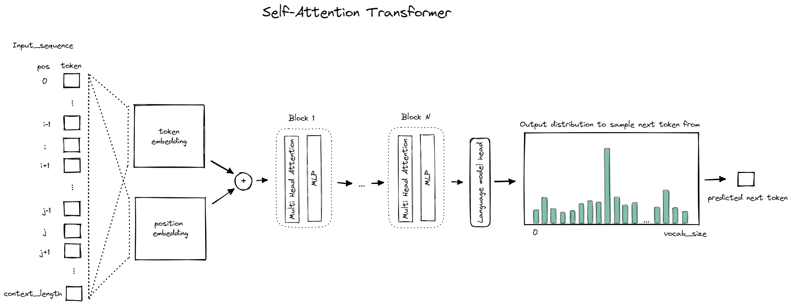
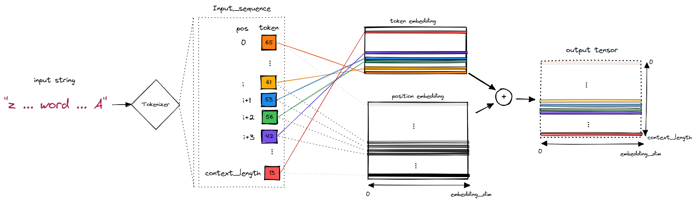

# understand_gpt
Repo set up for personal understanding of transformers, attention and the GPT architecture   

Based mostly on:  
https://github.com/karpathy/nanoGPT  
https://www.youtube.com/watch?v=kCc8FmEb1nY&t=4102s (karpathy - how to build GPTs)  
https://arxiv.org/pdf/1706.03762.pdf (Vaswani et. al. - "Attention is all you need" original paper)  
https://www.youtube.com/watch?v=dichIcUZfOw (Hedu AI transformer series - Embeddings)  
https://www.youtube.com/watch?v=mMa2PmYJlCo (Hedu AI transformer series - Attention)  

# Transformer Architecture

The Transformer Architecture is closely linked to the concept of attention, and particularly to self-attention in case of a GPT.

The relevant components of the transformer architecture using self-attention are shown in the below figure:  

## Embeddings

Before the actual attention is happening, the series of input tokens is passed though two separate embedding layers, which are essentially lookup tables. One is the token embedding layer which holds a unique vector specific to each token in the vocabulary. The other is the position embedding, which is similar to the token embedding with the difference that rather than encoding the token into a vector it encodes the token's position. In the original attention paper the position embedding was manually defined in the example shown here it is set to be data dependant.

The following figure attempts to illustrate the process of embedding a string, i.e. a sequence of input tokens. The value of the token is used to index the token embedding lookup table which is of shape `(vocab_size, embedding_dim)`. The resulting tensor is a stack of the embeddings of all tokens in the sequence and of shape `(context_length, embedding_dim)`. The position of each token in the sequence is used to index the position embedding, which is of shape `(context_length, embedding_dim)` and returns a tensor of the same shape.

The tensors returned from the two embeddings are added up so that you end up with a higher dimensional representation for each token and the respective position it takes in the input sequence. This result is then passed to the attention blocks.

## Attention Blocks